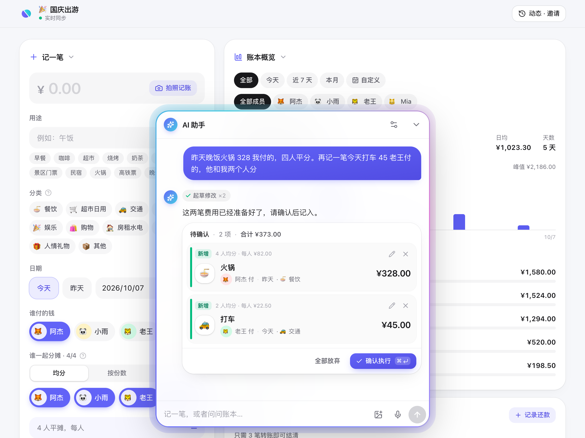

<p align="center">
  
</p>

<h1 align="center">AAPay</h1>

<p align="center">Split shared expenses without the spreadsheet — a self-hosted group ledger</p>

<p align="center">
  <a href="https://deploy.workers.cloudflare.com/?url=https://github.com/LYJW131/aapay"></a>
</p>

<p align="center">
  <a href="LICENSE"></a>
  <a href="https://github.com/LYJW131/aapay/pkgs/container/aapay"></a>
  
</p>

<p align="center"><a href="README.md">简体中文</a> · English</p>

<p align="center">
  
</p>

On trips, in shared flats or at group dinners, everyone pays for something and someone has to work out who owes whom. With AAPay, friends join a ledger with a passcode, log expenses as they go, see each other's changes live, and settle up with the fewest possible transfers. You can log expenses by talking to the AI assistant or snapping a receipt, and connect the ledger to AI apps such as Claude and ChatGPT.

One TypeScript codebase deploys to Cloudflare Workers in one click (the free plan is enough) or runs on your own server with Docker. The interface is available in English and Simplified Chinese.

## Features

- **Join with a passcode**: enter a passcode, open an invite link or scan a QR code — no accounts
- **Flexible splits**: split evenly, by shares (2 for adults, 1 for kids) or by exact amounts; all math is done in integer cents, so splits always add up
- **Minimal settle-up**: computes net balances from expenses and repayments and suggests the fewest transfers; tap "Paid" to record one
- **Live sync**: WebSocket updates with notifications, automatic catch-up after reconnecting
- **AI assistant**: log expenses from a sentence, a photo or your voice; edit entries, add members or ask "where did the money go this month". Every change is proposed as a card and only written after you confirm, and can be undone
- **Connect AI apps**: a built-in remote MCP endpoint protected by OAuth 2.1 for Claude, ChatGPT, Claude Code, Cursor and more
- **Tamper-evident activity log**: every change is recorded in a hash chain, optionally signed with Ed25519; the database refuses edits and deletes, and browsers verify the chain
- **Undo anything**: every write is an atomic change set that can be reverted exactly
- **Filters and export**: date ranges, members, categories, keywords, category totals, daily charts and CSV export
- **Admin card**: create / switch / delete ledgers, issue passcodes with expiry and QR codes, revoke access instantly
- **Also**: mobile-first, dark mode, installable as a home screen app

## Deploy to Cloudflare

### One click

Click **Deploy to Cloudflare** above. Cloudflare copies this repository to your GitHub / GitLab account, creates the Worker and connects Workers Builds, so every push to your copy redeploys automatically.

The deploy page asks for:

| Name | Description |
| --- | --- |
| `MODE` | `isolated`: many ledgers, joined with passcodes (recommended); `shared`: one public ledger, no admin panel |
| `ADMIN_AUTH` | How the admin signs in — keep `password` |
| `ADMIN_PASSWORD` | Admin password, at least 8 characters (required, the site won't work without it) |

Durable Objects and rate limiters are created for you. Once deployed:

1. Open `https://<your-worker>.workers.dev/admin` and sign in with the admin password
2. Create a ledger, generate a passcode and send the invite link or QR code to your friends

### After deploying

> [!IMPORTANT]
> Workers Builds replaces the Worker's plain variables with the repository config on every deploy, so plain variables edited under the Worker's "Variables and Secrets" are lost on the next deploy. Put plain variables and the custom domain in **Settings → Builds → Variables and secrets** (build variables); they are injected into the deploy config at build time. Secrets (`ADMIN_PASSWORD`, `GEMINI_API_KEY`, …) belong in **Settings → Variables and Secrets** and are never removed by deploys.

Common settings:

- **Custom domain**: add the build variable `CUSTOM_DOMAIN=aapay.example.com` (the zone must be on the same Cloudflare account). The next deploy binds the domain and turns off the `workers.dev` URL
- **AI assistant**: add the secret `GEMINI_API_KEY` ([get a Gemini API key](https://aistudio.google.com/apikey)). To switch provider, set the variable `ASSISTANT_PROVIDER` and add its secret: `deepseek` uses `DEEPSEEK_API_KEY` ([get one](https://platform.deepseek.com/api_keys)), `claude` uses `CLAUDE_API_KEY` ([get one](https://platform.claude.com/settings/keys)), `openai` (any OpenAI-compatible service) uses `OPENAI_API_KEY` plus the variables `OPENAI_BASE_URL` and `OPENAI_MODEL`. Without one, each user can pick a provider and enter their own key in the assistant settings
- **Signed activity log**: add the secret `AUDIT_SIGNING_KEY`, generated with `node -e "console.log(crypto.randomBytes(32).toString('base64url'))"`. Don't change it afterwards
- **Other variables**: any plain variable from [Configuration](#configuration) can be set as a build variable of the same name, e.g. `TIMEZONE` or `ASSISTANT`

The build validates the configuration with the same rules as the runtime, so a mistake fails the build and leaves the live version untouched.

<details>
<summary><b>Sign in with Cloudflare Access instead of a password</b></summary>

1. In Cloudflare Zero Trust → Access, create a **Self-hosted** application:
   - Protect only `your-domain/api/admin/login`. The other admin APIs use the session issued at login; putting them behind Access makes expired requests redirect to the login page and fail
   - Policy: Allow, Include → Emails → your email
2. Add build variables `ADMIN_AUTH=access`, `ACCESS_TEAM_DOMAIN=<team>.cloudflareaccess.com`, `ACCESS_AUD=<the application's AUD tag>` and optionally `ADMIN_EMAILS=you@example.com` (allow list)
3. Redeploy

The Worker verifies the Access JWT itself (signature, issuer, audience and the optional allow list), so requests that bypass Access never get an admin session.

</details>

<details>
<summary><b>Preview deployments</b></summary>

With Previews enabled in Workers Builds, pushing other branches runs `npx wrangler preview` and deploys to `<branch>-<worker>.<subdomain>.workers.dev`. Each preview has its own Durable Object storage, isolated from production. Previews have their own build variables with the same rules. `wrangler preview` doesn't reuse previously set secrets; if a preview needs them, generate a `--secrets-file` from build secrets in the preview deploy command.

</details>

### Deploy manually with Wrangler

```bash
npm install
npx wrangler login
npx wrangler secret put ADMIN_PASSWORD
CUSTOM_DOMAIN=aapay.example.com npm run deploy   # drop CUSTOM_DOMAIN if you don't need one
```

Any [configuration](#configuration) variable set for `npm run deploy` is injected the same way, e.g. `ADMIN_AUTH=access ACCESS_TEAM_DOMAIN=... ACCESS_AUD=... npm run deploy`.

## Deploy with Docker

```bash
mkdir aapay && cd aapay
curl -O https://raw.githubusercontent.com/LYJW131/aapay/main/docker-compose.yml
curl -o .env https://raw.githubusercontent.com/LYJW131/aapay/main/.env.example
# Edit .env: set at least ADMIN_AUTH=password and ADMIN_PASSWORD
docker compose up -d
```

Open <http://localhost:8787/admin> to sign in. Data lives in `./data` (`registry.db` plus one `ledgers/<id>.db` per ledger) — back up that directory. To upgrade: `docker compose pull && docker compose up -d`.

- Image: `ghcr.io/lyjw131/aapay` for `linux/amd64` and `linux/arm64`; `latest` tracks `main`, release tags publish `1.2.3` / `1.2` / `1`
- Based on `node:24-alpine` with Node's built-in `node:sqlite`, no native dependencies
- Behind a reverse proxy, set `PUBLIC_URL`, enable `TRUST_PROXY`, and disable response buffering for `/api/ledger/assistant` (the server already sends `X-Accel-Buffering: no`)

Without Docker (Node.js ≥ 22.13):

```bash
npm install
npm run build:node
npm start   # reads .env
```

## Configuration

Cloudflare and Docker share the same variable names: on Cloudflare, plain variables are injected as build variables and secrets are Worker secrets; with Docker, put everything in `.env`.

| Variable | Description | Default |
| --- | --- | --- |
| `MODE` | `isolated`: many ledgers joined with passcodes; `shared`: one public ledger, no passcode, no admin panel | `isolated` |
| `ADMIN_AUTH` | Admin sign-in: `password` / `access` / `proxy` / `none` / `disabled` | `password` in the Cloudflare template, otherwise `disabled` |
| `ADMIN_PASSWORD` | Admin password for `password` mode, at least 8 characters (secret) | — |
| `ACCESS_TEAM_DOMAIN` | `access` mode: Access team domain, e.g. `myteam.cloudflareaccess.com` | — |
| `ACCESS_AUD` | `access` mode: the Access application's AUD tag | — |
| `ADMIN_EMAIL_HEADER` | `proxy` mode: header carrying the identity from the upstream proxy | `X-Forwarded-Email` |
| `ADMIN_EMAILS` | Comma-separated admin allow list (`access` / `proxy` modes) | — |
| `MCP` | `enabled` / `disabled`: the MCP endpoint and OAuth server | `enabled` |
| `PUBLIC_URL` | Public URL used as OAuth issuer and MCP resource; inferred from requests when unset, recommended behind a proxy | — |
| `TIMEZONE` | Time zone for "today" when the AI doesn't get a date | `Asia/Shanghai` |
| `ASSISTANT` | `enabled` / `disabled`: the AI assistant | `enabled` |
| `ASSISTANT_PROVIDER` | `gemini` / `deepseek` / `claude` / `openai` (OpenAI-compatible): the AI provider the site uses | `gemini` |
| `GEMINI_API_KEY` / `DEEPSEEK_API_KEY` / `CLAUDE_API_KEY` / `OPENAI_API_KEY` | Site-wide key (secret); only the one for `ASSISTANT_PROVIDER` is used. Without it, users pick a provider and bring their own key, kept only in their browser and forwarded per request, never stored | — |
| `GEMINI_MODEL` / `DEEPSEEK_MODEL` / `CLAUDE_MODEL` | Default model per provider; users with their own key can pick another | `gemini-flash-lite-latest` / `deepseek-flash` / `claude-haiku-5-5` |
| `OPENAI_BASE_URL` / `OPENAI_MODEL` | Base URL (e.g. `https://api.example.com/v1`) and model of an OpenAI-compatible service, required with `ASSISTANT_PROVIDER=openai`. A fallback: plain streaming chat and function calling, image reading via JSON in the prompt; a user's own base URL must be public https | — |
| `AUDIT_SIGNING_KEY` | Ed25519 private key for the activity log, 32 bytes base64url (secret). Without it there's only the hash chain. Don't rotate it, or members' browsers will warn about a changed key | — |
| `CUSTOM_DOMAIN` | Cloudflare builds only: the custom domain to bind | — |
| `PORT` / `DATA_DIR` | Node / Docker only: port and data directory | `8787` / `./data` |
| `TRUST_PROXY` | Node / Docker only: when `enabled`, the client IP (used by the login and join rate limits) is the last `X-Forwarded-For` entry; enable only when a reverse proxy sits in front and the server is not directly reachable | `disabled` |

Admin sign-in modes:

- **password**: built-in password with brute-force rate limiting, good for most self-hosted setups
- **access**: Cloudflare Access handles sign-in (Cloudflare Workers, or Docker behind Cloudflare Tunnel)
- **proxy**: reuse oauth2-proxy / Authelia / Traefik ForwardAuth; `/api/admin/login` trusts the identity header (don't expose the app directly)
- **none**: no check, local development only

The external identity is checked once at `/admin` → `/api/admin/login` and exchanged for a site session (HttpOnly cookie, 24 hours); every request re-checks that the person is still an admin.

## Connect AI apps (MCP)

AAPay ships a remote MCP server at `https://your-domain/mcp` (copy it from "Connect AI" at the top right of a ledger).

| App | How to add |
| --- | --- |
| Claude (web / desktop / mobile) | Settings → Connectors → Add custom connector, paste the URL |
| ChatGPT | Settings → Apps & Connectors → Advanced, enable developer mode, create a connector with the URL and OAuth |
| Claude Code | `claude mcp add --transport http aapay https://your-domain/mcp` |
| Cursor / VS Code, etc. | Add it as a remote MCP server |

The app then opens AAPay's consent page: one click if this browser has opened the ledger, otherwise enter the ledger's passcode; read-only access is an option. Then just say "I paid 128 for dinner, split four ways" or "how do we settle up". Changes appear live for everyone, labelled with the app that made them.

- **Tools**: `get_ledger`, `list_transactions`, `add_expense` / `update_expense` / `delete_expense`, `add_member` / `update_member`, `record_settlement` / `delete_settlement`, `list_activity`. Amounts are in yuan (CNY) and members can be referred to by name
- **Admin grants**: a signed-in admin can grant "all ledgers", adding `list_ledgers`, `create_ledger`, `update_ledger`, `delete_ledger`, `list_passphrases` / `create_passphrase` / `revoke_passphrase`
- **Grant model**: a member grant covers one ledger and ends when its passcode is revoked or expires or the ledger is deleted; members can review and disconnect apps under "Connect AI"

Implementation follows the [MCP Authorization](https://modelcontextprotocol.io/specification/2025-11-25/basic/authorization) spec: stateless Streamable HTTP, RFC 9728 / 8414 discovery, dynamic registration (RFC 7591) and Client ID Metadata Documents, PKCE (S256 only), resource indicators (RFC 8707), `iss` in callbacks (RFC 9207), `private_key_jwt` (RFC 7523), step-up via `insufficient_scope`, rotating refresh tokens and revocation (RFC 7009).

## Local development

Requires Node.js ≥ 22.13.

```bash
npm install
cp .dev.vars.example .dev.vars   # uncomment ADMIN_AUTH=none to be signed in as admin at /admin
npm run dev                      # Vite + Cloudflare plugin, runs the Worker and Durable Objects in local workerd
node scripts/seed.mjs            # optional: create a demo ledger (passcode demo2026)
```

Open <http://localhost:5173>. For the Node runtime, use `npm run dev:node` (server on 8787, proxied by Vite).

```bash
npm run typecheck   # TypeScript (web / worker / node projects)
npm test            # vitest
npm run build       # Cloudflare build
npm run build:node  # Node / Docker build
```

See the [Chinese README](README.md#架构) for an architecture overview.

## Contributing

Issues and pull requests are welcome — see [CONTRIBUTING.md](CONTRIBUTING.md). Please report security issues privately as described in [SECURITY.md](SECURITY.md).

## License

[MIT](LICENSE)
