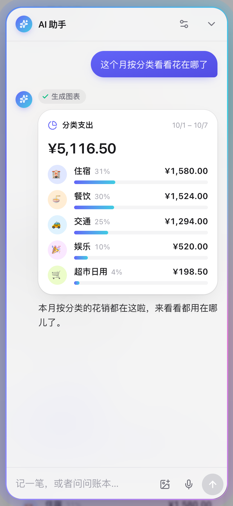

<p align="center">
  
</p>

<h1 align="center">AAPay</h1>

<p align="center">一起花钱，轻松算账 —— 自托管的多人记账与结算工具</p>

<p align="center">
  <a href="https://deploy.workers.cloudflare.com/?url=https://github.com/LYJW131/aapay"></a>
</p>

<p align="center">
  <a href="LICENSE"></a>
  <a href="https://github.com/LYJW131/aapay/pkgs/container/aapay"></a>
  
</p>

<p align="center">简体中文 · <a href="README.en.md">English</a></p>

<p align="center">
  
</p>

旅行、合租、聚餐时，大家各自付钱，最后算谁该给谁多少。AAPay 让每个人用一个口令加入同一个账本，随手记账、实时同步，结算时给出最少的转账方案。可以对 AI 助手说一句话、拍一张小票来记账，也可以把账本接进 Claude、ChatGPT 等 AI 应用。

一套 TypeScript 代码，既能一键部署到 Cloudflare Workers（免费套餐即可），也能用 Docker 跑在自己的服务器上。

## 功能

- **口令加入**：输入分享口令、打开邀请链接或扫二维码即可加入，不用注册账号
- **记账与分摊**：均分、按份数（大人 2 份、小孩 1 份）或按金额分摊；全程以「分」为整数计算，零头分配后合计永远等于总额
- **最少转账结算**：综合支出与还款算出每人净额，给出转账次数最少的方案，点「已付」即记一笔还款
- **实时同步**：基于 WebSocket，其他人的修改立即出现并弹出通知，断线自动补齐
- **AI 助手**：一句话、拍照（或粘贴小票）、语音记账，也能改账、加成员、问「这个月花在哪了」。所有修改先生成待确认卡片，确认后才写入，可撤销
- **连接 AI 应用**：内置 OAuth 2.1 保护的远程 MCP 端点，在 Claude、ChatGPT、Claude Code、Cursor 里添加后用自然语言记账查账
- **可审计**：每次修改都进入哈希链式的操作动态，可选 Ed25519 签名，数据库层禁止改删，浏览器逐条校验
- **全部可撤销**：每次写入都是一个原子变更集，记账、改账、删除、还款都能精确撤销
- **筛选与导出**：按日期范围、成员、分类、关键词筛选，分类汇总与每日支出图，导出 CSV
- **管理员卡片**：新建 / 切换 / 删除账本，生成带有效期的口令与二维码，撤销口令后对应成员立即失效
- **其他**：移动端优先、深色模式、可添加到主屏幕、简体中文与英文界面

<p align="center">
  
</p>
<p align="center">
  
  
</p>

## 部署到 Cloudflare

### 一键部署

点击上方的 **Deploy to Cloudflare** 按钮。Cloudflare 会把本仓库复制到你的 GitHub / GitLab 账号，创建 Worker 并接好 Workers Builds，之后你推送到自己仓库就会自动重新部署。

部署页会让你填写：

| 名称 | 说明 |
| --- | --- |
| `MODE` | `isolated`：多账本，凭口令加入（推荐）；`shared`：单一公共账本，打开即用，没有管理后台 |
| `ADMIN_AUTH` | 管理员登录方式，保持 `password` 即可 |
| `ADMIN_PASSWORD` | 管理员密码，至少 8 位（不填会导致站点无法使用） |

Durable Objects 与限流会自动创建，不需要手动建数据库。部署完成后：

1. 打开 `https://<你的 Worker>.workers.dev/admin`，用管理员密码登录
2. 新建账本，生成分享口令，把邀请链接或二维码发给朋友

### 部署后的配置

> [!IMPORTANT]
> Workers Builds 每次部署都会用仓库里的配置覆盖 Worker 的普通变量，所以不要在 Worker 的「变量和机密」里改普通变量，下次部署就没了。普通变量和自定义域名请写在 **Settings → Builds → Variables and secrets**（构建变量）里，构建时会注入到部署配置中；密钥（`ADMIN_PASSWORD`、`GEMINI_API_KEY` 等）放在 **Settings → Variables and Secrets** 里，部署不会删除它们。

常用的几项：

- **自定义域名**：添加构建变量 `CUSTOM_DOMAIN=aapay.example.com`（域名需托管在同一 Cloudflare 账号），重新部署后 Worker 绑定到这个域名，并关闭 `workers.dev` 地址
- **AI 助手**：添加密钥 `GEMINI_API_KEY`（[获取 Gemini API Key](https://aistudio.google.com/apikey)）。不配置时，每个用户可以在 AI 助手设置里填自己的 Key
- **操作动态签名**：添加密钥 `AUDIT_SIGNING_KEY`，用 `node -e "console.log(crypto.randomBytes(32).toString('base64url'))"` 生成，设置后不要更换
- **其他变量**：「[配置](#配置)」表里的普通变量都可以用同名构建变量覆盖，例如 `TIMEZONE`、`ASSISTANT`

构建时会按运行时的同一套规则校验配置，配错会让构建失败，线上版本保持不变。

<details>
<summary><b>用 Cloudflare Access 登录管理员（替代密码）</b></summary>

1. 在 Cloudflare Zero Trust → Access 新建 **Self-hosted** 应用：
   - 目标只填 `你的域名/api/admin/login` 一条。其余管理接口只认登录后签发的管理员会话，不能放进 Access，否则会话过期时浏览器的请求会被重定向到登录页而失败
   - 策略：Allow，Include → Emails → 你的邮箱
2. 添加构建变量：`ADMIN_AUTH=access`、`ACCESS_TEAM_DOMAIN=<团队>.cloudflareaccess.com`、`ACCESS_AUD=<应用的 AUD Tag>`，可选 `ADMIN_EMAILS=you@example.com`（白名单）
3. 重新部署

登录时 Worker 会独立校验 Access 签发的 JWT（签名、issuer、audience 与可选的邮箱白名单），绕过 Access 直连 Worker 拿不到管理员会话。

</details>

<details>
<summary><b>Preview 部署</b></summary>

在 Workers Builds 开启 Previews 后，推送其他分支会用 `npx wrangler preview` 部署到 `<分支>-<Worker>.<子域>.workers.dev`，每个 Preview 的 Durable Objects 存储独立，与生产数据隔离。Preview 的构建变量单独设置（Settings → Builds → Previews），规则与生产相同。`wrangler preview` 不会沿用之前设置的密钥，需要的话在 Preview 的部署命令里用 `--secrets-file` 从构建密钥生成。

</details>

### 用 Wrangler 手动部署

```bash
npm install
npx wrangler login
npx wrangler secret put ADMIN_PASSWORD
CUSTOM_DOMAIN=aapay.example.com npm run deploy   # 不需要自定义域名就去掉 CUSTOM_DOMAIN
```

`npm run deploy` 时设置的「[配置](#配置)」变量同样会注入，例如 `ADMIN_AUTH=access ACCESS_TEAM_DOMAIN=... ACCESS_AUD=... npm run deploy`。

## 部署到 Docker

```bash
mkdir aapay && cd aapay
curl -O https://raw.githubusercontent.com/LYJW131/aapay/main/docker-compose.yml
curl -o .env https://raw.githubusercontent.com/LYJW131/aapay/main/.env.example
# 编辑 .env：至少设置 ADMIN_AUTH=password 与 ADMIN_PASSWORD
docker compose up -d
```

打开 <http://localhost:8787/admin> 登录管理员。数据保存在 `./data`（`registry.db` + 每个账本一个 `ledgers/<id>.db`），备份这个目录即可。升级：`docker compose pull && docker compose up -d`。

- 镜像 `ghcr.io/lyjw131/aapay`，支持 `linux/amd64` 与 `linux/arm64`；`latest` 跟随 `main`，`1.2.3` / `1.2` / `1` 对应发布标签。国内可用阿里云镜像 `crpi-762preaq1jtfja6k.cn-hangzhou.personal.cr.aliyuncs.com/lyjw131/aapay`（同一份镜像，无需登录）
- 基于 `node:24-alpine`，使用 Node 内置的 `node:sqlite`，不含原生依赖
- 放在反向代理后面时建议设置 `PUBLIC_URL`，并关闭代理对 `/api/ledger/assistant` 的响应缓冲（服务端已带 `X-Accel-Buffering: no`）

不用 Docker 也可以直接运行（需要 Node.js ≥ 22.13）：

```bash
npm install
npm run build:node
npm start   # 读取 .env
```

## 配置

Cloudflare 与 Docker 使用同一套变量名：Cloudflare 上普通变量用构建变量注入、密钥用 Worker Secret；Docker 写在 `.env`。

| 变量 | 说明 | 默认 |
| --- | --- | --- |
| `MODE` | `isolated`：多账本 + 口令加入；`shared`：单一公共账本，无需口令，关闭管理后台 | `isolated` |
| `ADMIN_AUTH` | 管理员认证：`password` / `access` / `proxy` / `none` / `disabled` | Cloudflare 模板为 `password`，其余为 `disabled` |
| `ADMIN_PASSWORD` | `password` 模式的管理员密码，至少 8 位（密钥） | — |
| `ACCESS_TEAM_DOMAIN` | `access` 模式：Access 团队域名，如 `myteam.cloudflareaccess.com` | — |
| `ACCESS_AUD` | `access` 模式：Access 应用的 AUD Tag | — |
| `ADMIN_EMAIL_HEADER` | `proxy` 模式：上游代理传入身份的请求头 | `X-Forwarded-Email` |
| `ADMIN_EMAILS` | 管理员邮箱白名单，逗号分隔（`access` / `proxy` 模式） | — |
| `MCP` | `enabled` / `disabled`：是否开放 MCP 端点与 OAuth 授权服务 | `enabled` |
| `PUBLIC_URL` | 对外访问地址，作为 OAuth issuer 与 MCP 资源标识；不填按请求推断，反向代理后建议填写 | — |
| `TIMEZONE` | AI 记账未指定日期时按此时区取「今天」 | `Asia/Shanghai` |
| `ASSISTANT` | `enabled` / `disabled`：是否开放 AI 助手 | `enabled` |
| `GEMINI_API_KEY` | 站点提供的 Gemini API 密钥（密钥）；不填时用户在 AI 助手设置里填自己的 Key，只存在其浏览器里、按请求转交 Gemini，不落库 | — |
| `GEMINI_MODEL` | AI 助手默认模型；用户自带 Key 时可以换别的模型 | `gemini-flash-lite-latest` |
| `AUDIT_SIGNING_KEY` | 操作动态的 Ed25519 签名私钥，32 字节 base64url（密钥）；不填则只有哈希链。设置后不要更换，否则成员的浏览器会提示公钥变化 | — |
| `CUSTOM_DOMAIN` | 仅 Cloudflare 构建时：绑定的自定义域名 | — |
| `PORT` / `DATA_DIR` | 仅 Node / Docker：端口与数据目录 | `8787` / `./data` |

管理员认证方式：

- **password**：内置密码登录，带防爆破限流，适合大多数自托管场景
- **access**：由 Cloudflare Access 负责登录（Cloudflare Workers，或 Docker + Cloudflare Tunnel）
- **proxy**：沿用 oauth2-proxy / Authelia / Traefik ForwardAuth 等上游认证，在 `/api/admin/login` 信任其传入的身份头（确保应用不直接暴露）
- **none**：不校验，仅限本地开发

外部身份只在登录（`/admin` → `/api/admin/login`）时校验一次，之后换成本站的管理员会话（HttpOnly Cookie，24 小时），每次请求都会按当前配置重新确认此人仍是管理员。

## 连接 AI（MCP）

AAPay 自带远程 MCP 服务器，地址是 `https://你的域名/mcp`（账本页右上角「连接 AI」可一键复制）。

| 应用 | 添加方式 |
| --- | --- |
| Claude（网页 / 桌面 / 手机） | 设置 → 连接器 → 添加自定义连接器，粘贴地址 |
| ChatGPT | 设置 → 应用与连接器 → 高级设置中打开开发者模式，创建连接器并粘贴地址，认证选 OAuth |
| Claude Code | `claude mcp add --transport http aapay https://你的域名/mcp` |
| Cursor / VS Code 等 | 按各自的远程 MCP 配置填入地址 |

添加后会打开 AAPay 的授权页：在这个浏览器打开过账本可以一键授权，否则输入账本的分享口令；也可以只给只读权限。之后就可以说「我付了 128 的晚饭，四个人分」「这周谁花得最多」「怎么转账能结清」，修改会实时出现在所有人的页面上，并标注是哪个应用改的。

- **工具**：`get_ledger`、`list_transactions`、`add_expense` / `update_expense` / `delete_expense`、`add_member` / `update_member`、`record_settlement` / `delete_settlement`、`list_activity`。金额以「元」为单位，成员可以用名字指代
- **管理员连接**：已登录的管理员授权时可选「全部账本」，额外获得 `list_ledgers`、`create_ledger`、`update_ledger`、`delete_ledger`、`list_passphrases` / `create_passphrase` / `revoke_passphrase`
- **授权模型**：成员授权只对应一个账本，口令被撤销、过期或账本被删除时一并失效；成员可在「连接 AI」里查看和断开已连接的应用

<details>
<summary><b>协议细节</b></summary>

按 [MCP Authorization](https://modelcontextprotocol.io/specification/2025-11-25/basic/authorization) 规范实现：

- 传输：Streamable HTTP 无状态模式，`POST /mcp` 直接返回 JSON；协议版本 `2025-11-25`，兼容 `2025-06-18` / `2025-03-26`
- 发现：`/.well-known/oauth-protected-resource`（RFC 9728）与 `/.well-known/oauth-authorization-server`（RFC 8414），未授权请求返回带 `resource_metadata` 的 `WWW-Authenticate`
- 客户端：动态注册（RFC 7591）与 Client ID Metadata Document；令牌端点认证支持 `none`（PKCE）、`client_secret_*` 与 `private_key_jwt`（RFC 7523）
- 授权码 + PKCE（仅 `S256`），`resource` 参数（RFC 8707）把令牌绑定到 `/mcp`，回调带 `iss`（RFC 9207）；作用域 `ledger:read` / `ledger:write`
- 只读令牌调用修改类工具返回 `403` 与 `insufficient_scope`（step-up 授权）；工具列表对所有授权相同，权限在调用时检查
- 访问令牌 1 小时，刷新令牌每次使用即轮换，授权最长 180 天且不超过口令有效期；支持撤销（RFC 7009）
- 令牌只存 SHA-256 哈希；授权页禁止被嵌入

</details>

## 本地开发

需要 Node.js ≥ 22.13。

```bash
npm install
cp .dev.vars.example .dev.vars   # 取消注释 ADMIN_AUTH=none，打开 /admin 即以管理员登录
npm run dev                      # Vite + Cloudflare 插件，在本地 workerd 里运行 Worker 与 Durable Objects
node scripts/seed.mjs            # 可选：写入演示账本（口令 demo2026）
```

打开 <http://localhost:5173>。也可以用 Node 运行时开发：`npm run dev:node`（Node 服务监听 8787，Vite 代理 API）。

```bash
npm run typecheck   # TypeScript（web / worker / node 三个工程）
npm test            # vitest
npm run build       # Cloudflare 构建
npm run build:node  # Node / Docker 构建
```

## 架构

```
                  ┌──────────── React 19 SPA（Vite · Tailwind CSS 4 · motion）────────────┐
                  │                hono/client 端到端类型 · WebSocket 实时同步               │
                  └──────────────────────────────────┬──────────────────────────────────┘
                                                     │ /api/* · /mcp
                         ┌───────────────────────────┴────────────────────────────┐
                         │      Hono API（src/server/app.ts，平台无关）              │
                         │  会话 Cookie · 管理员认证 · zod 校验 · 业务服务（同步 SQL）  │
                         └─────────────┬────────────────────────────┬─────────────┘
                     Cloudflare Workers │                            │ Docker / Node
          ┌─────────────────────────────┴───────┐      ┌─────────────┴───────────────────────┐
          │ RegistryRoom（Durable Object）        │      │ data/registry.db（node:sqlite）      │
          │   账本列表 · 口令 · 会话 · OAuth       │      │ data/ledgers/<id>.db 每账本一个库     │
          │ LedgerRoom × N（每个账本一个 DO）      │      │ ws 实时推送 · 内置限流                │
          │   内置 SQLite · WebSocket Hibernation │      │ 单文件打包，运行时无 node_modules      │
          └─────────────────────────────────────┘      └──────────────────────────────────────┘
```

- **每个账本一个独立数据库**：Cloudflare 上是一个 Durable Object（数据与实时连接在同一个对象里，强一致），Docker 中是一个 SQLite 文件
- **所有写入都是变更集**：成员、支出、还款的增改删统一表示为一组 `Change`，在一个事务里原子执行并写入审计，返回可直接回放的撤销变更集。网页、MCP 与 AI 助手共用这一条写路径
- **版本号驱动的同步**：每次变更递增版本号并广播，客户端发现缺口时重新拉取快照
- **AI 助手不直接写库**：服务端让 Gemini 通过函数调用读账、提议变更，并在事务里预演后回滚；回复以 SSE 流式推送，用户在卡片上确认后才写入

```
src/
├── shared/      前后端共用：类型、zod 校验、变更集、金额、结算算法
├── server/
│   ├── app.ts       Hono API（平台无关）
│   ├── core/        账本与注册表服务、SQL 抽象、审计
│   ├── mcp/         OAuth 2.1 授权服务器与 MCP 端点
│   ├── tools/       账本工具（MCP 与 AI 助手共用）
│   ├── ai/          AI 助手（Gemini）
│   ├── cloudflare/  Worker 入口与 Durable Objects
│   └── node/        Node 入口、node:sqlite、WebSocket
└── web/         React 前端
tests/           vitest：金额、结算、账本服务、API、OAuth + MCP、AI 助手
```

## 参与贡献

欢迎提 Issue 和 Pull Request，开发约定见 [CONTRIBUTING.md](CONTRIBUTING.md)。安全问题请按 [SECURITY.md](SECURITY.md) 私下报告。

## 许可证

[MIT](LICENSE)
