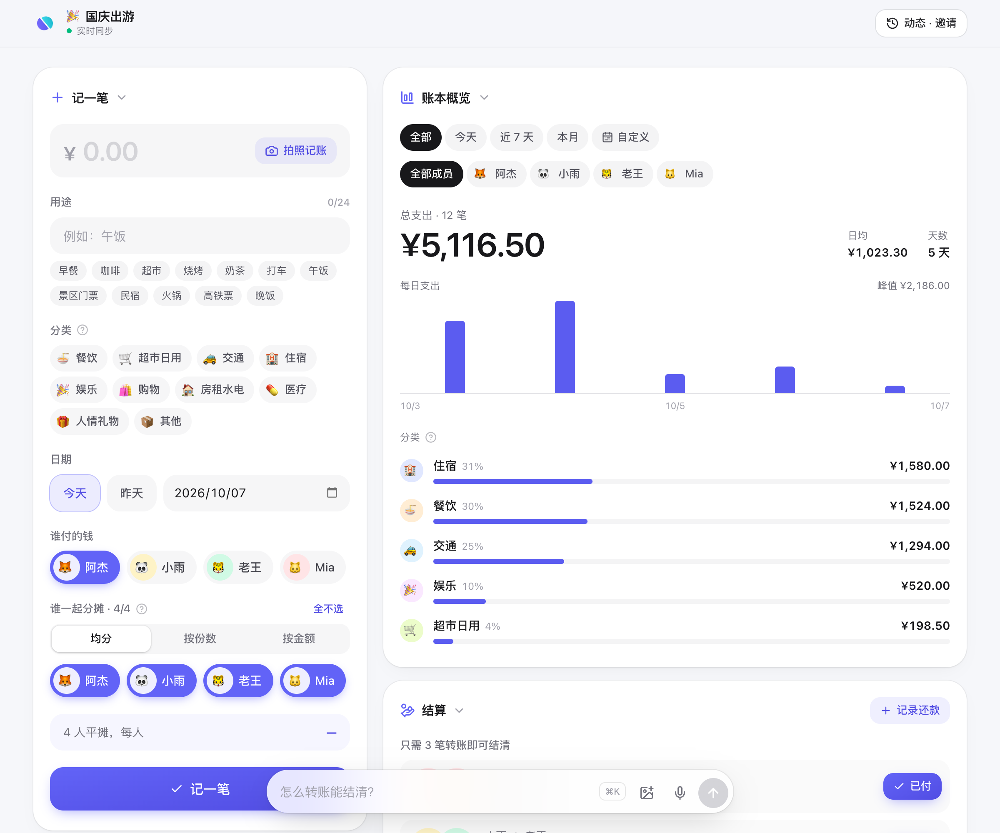
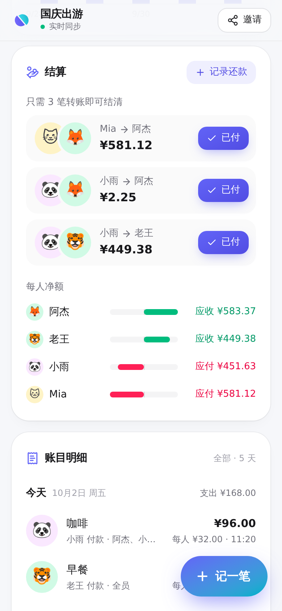
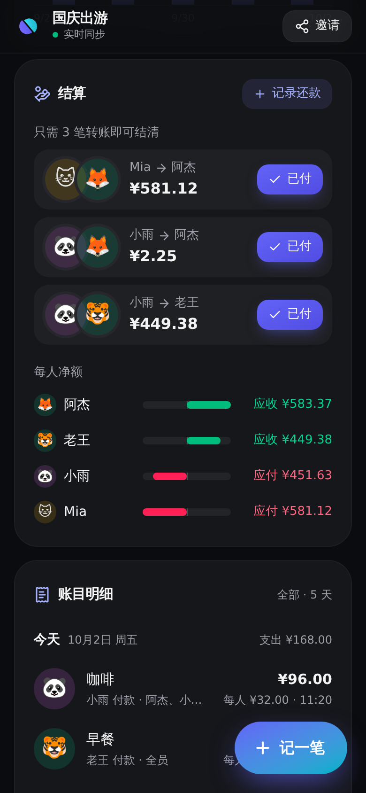
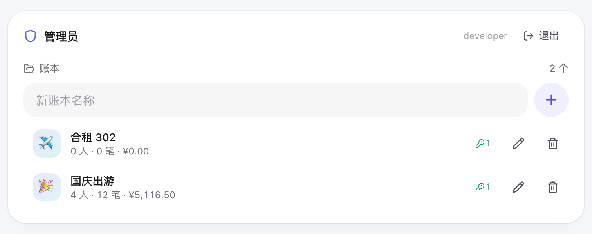

<p align="center">
  
</p>

<h1 align="center">AAPay</h1>

<p align="center">一起花钱，轻松算账 —— 多人记账、实时同步、一键结算</p>

<p align="center">
  
</p>
<p align="center">
  
  
</p>
<p align="center">
  
</p>

---

## 功能

- **口令加入**：协作者输入分享口令，或打开带口令的链接 / 扫二维码即可加入账本，无需注册
- **多日账本**：账目按天分组展示，每天带小计；支持「全部 / 今天 / 近 7 天 / 本月 / 自定义」范围与按成员筛选，附每日（或每月）支出柱状图，点击柱子可下钻到当天
- **结算**：综合全部支出与已记录的还款，计算每人净额并给出**最少转账方案**；点「已付」即记下一笔「谁向谁支付了多少」（可撤销），也可手动记录任意还款
- **记账**：金额、用途（常用用途一键填入）、日期、付款人、分摊成员；付款人一选就记住、下次自动预选，分摊成员沿用上一笔；从邀请链接首次进入时会问「你是哪一位」，选择已有成员或把自己加进来即设为默认付款人；支出可编辑、删除
- **金额精确**：全程以「分」为整数存储，均摊的零头按成员加入顺序分配，合计永远等于总额
- **实时同步**：基于 WebSocket，其他人的操作即时出现并弹出通知；断线自动重连并补齐数据
- **管理员卡片**：管理员登录后，账本页顶部多一张可折叠的管理卡片——切换 / 新建 / 删除账本，修改账本名称与图标（emoji，显示在账本页标题上），为当前账本生成带有效期的口令（1 天、7 天、30 天、永久或自定义时间段）、二维码邀请；撤销口令后用它登录的成员立即失效。`/admin` 是管理员登录入口
- **连接 AI**：内置 OAuth 2.1 保护的远程 MCP 端点 `/mcp`，在 Claude、ChatGPT 等应用里添加连接器后，就能用自然语言记账、查账、算结算；修改实时同步给所有人（见下文「连接 AI（MCP）」）
- **操作动态**：每一次记账、改账、加成员、生成口令、连接 AI 都会留下记录，所有成员都能在顶栏「动态」里查看谁在什么时候改了什么（改账会列出前后差异）。记录与变更在同一个事务里写入，操作者身份只取自服务端验证过的会话；记录串成哈希链并由服务器用 Ed25519 签名，数据库层禁止修改和删除，浏览器会逐条核对并记住上次校验到的位置，事后任何删改都会被发现
- **共享模式**：单一公共账本，打开即用（适合固定室友）
- **体验**：移动端优先，底部抽屉式表单，自动跟随系统深色模式，可添加到主屏幕
- **中英双语**：界面与服务端错误提示支持简体中文和英文，默认跟随浏览器语言，也可在加入页、管理员登录页与主页、授权页和账本的「动态」面板里手动切换（记在本机）

## 架构

一套业务代码，两种运行方式：

```
                  ┌──────────── React 19 SPA（Vite · Tailwind CSS 4 · motion）────────────┐
                  │                hono/client 端到端类型 · WebSocket 实时同步               │
                  └──────────────────────────────────┬──────────────────────────────────┘
                                                     │ /api/*
                         ┌───────────────────────────┴────────────────────────────┐
                         │      Hono API（src/server/app.ts，平台无关）              │
                         │  会话 Cookie · 管理员认证 · zod 校验 · 业务服务（同步 SQL）  │
                         └─────────────┬────────────────────────────┬─────────────┘
                     Cloudflare Workers │                            │ Docker / Node
          ┌─────────────────────────────┴───────┐      ┌─────────────┴───────────────────────┐
          │ RegistryRoom（Durable Object）        │      │ data/registry.db（node:sqlite）      │
          │   账本列表 · 口令 · 会话               │      │ data/ledgers/<id>.db 每账本一个库     │
          │ LedgerRoom × N（每个账本一个 DO）      │      │ ws 实时推送 · 内置限流                │
          │   内置 SQLite · WebSocket Hibernation │      │ 单文件打包，运行时无 node_modules      │
          │ Workers Static Assets · Rate Limiting │      │                                      │
          └─────────────────────────────────────┘      └──────────────────────────────────────┘
```

- **每个账本一个独立数据库**：Cloudflare 上是一个 Durable Object（数据与实时连接在同一个对象里，强一致），Docker 中是一个 SQLite 文件
- **版本号驱动的同步**：每次变更递增版本号并广播事件，客户端发现缺口时自动重新拉取快照
- **会话**：口令换取随机会话令牌（HttpOnly Cookie），服务端只存其 SHA-256；撤销口令或删除账本会通过外键级联让会话立即失效

## 快速开始（本地开发）

需要 Node.js ≥ 22.13。

```bash
npm install
cp .dev.vars.example .dev.vars   # 本地放行管理员（ADMIN_AUTH=none）
npm run dev                      # Vite + Cloudflare 插件，在本地 workerd 中运行 Worker 与 Durable Objects
node scripts/seed.mjs            # 可选：生成演示账本（口令 demo2026）
```

打开 <http://localhost:5173>，管理员入口在 `/admin`（本地 `ADMIN_AUTH=none`，打开即登录）。

也可以用 Node 运行时开发：`npm run dev:node`（Node 服务监听 8787，Vite 代理 `/api`）。

## 部署到 Cloudflare

1. 修改 `wrangler.jsonc` 中的 `routes`（自定义域名）与 `vars`
2. 在 Cloudflare Zero Trust → Access 新建 **Self-hosted** 应用：
   - 目标只填 `你的域名/api/admin/login` 一条（其余管理接口只认登录后签发的管理员会话，不能放进 Access，否则会话过期时浏览器的请求会被重定向到登录页而失败）
   - 策略：Allow，Include → Emails → 你的邮箱
   - 把应用的 **Application Audience (AUD) Tag** 填入 `ACCESS_AUD`，团队域名（`xxx.cloudflareaccess.com`）填入 `ACCESS_TEAM_DOMAIN`
3. 部署：

   ```bash
   npx wrangler login
   npm run deploy
   ```

也可以用 **Workers Builds** 自动部署：在 Worker 的 Settings → Builds 关联 GitHub 仓库，构建命令 `npm run typecheck && npm test && npm run build`，部署命令 `npx wrangler deploy`，环境变量 `NODE_VERSION=24`。之后推送到监听的分支就会自动测试并上线（本项目监听 `main`，只改 `*.md` / `docs/` 不触发）。

`.github/workflows/deployments.yml` 会等 Workers Builds 的 check run 结束，把结果同步成 GitHub Deployments（`main` 对应 `production`，其他分支对应 `preview`），仓库主页右侧就会显示部署状态。

Durable Objects 与限流由 `wrangler.jsonc` 自动创建，无需手动建数据库。「识别账单」调用 DeepSeek 或 Gemini 的视觉模型，用 `npx wrangler secret put DEEPSEEK_API_KEY`（或 `GEMINI_API_KEY`）配置密钥，每个账本每分钟最多 10 次。登录时 Worker 会独立校验 Access 签发的 JWT（签名、issuer、audience，可选 `ADMIN_EMAILS` 白名单），通过后签发本站的管理员会话；绕过 Access 直连 Worker 拿不到会话，也就无法访问管理接口。

## 部署到 Docker

```bash
cp .env.example .env    # 按需修改，至少设置管理员认证方式
docker compose up -d --build
```

服务监听 `8787`，数据保存在 `./data`（`registry.db` + `ledgers/*.db`）。镜像基于 `node:24-alpine`，使用 Node 内置的 `node:sqlite`，不含任何原生依赖。

不想用 Docker 也可以直接运行：

```bash
npm run build:node && npm start   # 读取 .env
```

## 配置

Cloudflare（`wrangler.jsonc` 的 `vars` / `wrangler secret put`）与 Docker（`.env`）使用同一套变量：

| 变量 | 说明 | 默认 |
| --- | --- | --- |
| `MODE` | `isolated`：多账本 + 口令加入；`shared`：单一公共账本，无需口令，关闭管理后台 | `isolated` |
| `ADMIN_AUTH` | 管理员认证：`access` / `password` / `proxy` / `none` / `disabled` | `disabled` |
| `ACCESS_TEAM_DOMAIN` | `access` 模式：Access 团队域名，如 `myteam.cloudflareaccess.com` | — |
| `ACCESS_AUD` | `access` 模式：Access 应用的 AUD Tag | — |
| `ADMIN_PASSWORD` | `password` 模式：管理员密码（≥ 8 位；Cloudflare 上请用 secret） | — |
| `ADMIN_EMAIL_HEADER` | `proxy` 模式：上游代理传入身份的请求头 | `X-Forwarded-Email` |
| `ADMIN_EMAILS` | 可选，管理员邮箱白名单（逗号分隔，`access` / `proxy` 模式生效） | — |
| `MCP` | `enabled` / `disabled`：是否开放 MCP 端点与 OAuth 授权服务 | `enabled` |
| `PUBLIC_URL` | 可选，对外访问地址（如 `https://aapay.example.com`），作为 OAuth issuer 与 MCP 资源标识；不填则按请求推断（信任 `X-Forwarded-Proto/Host`），反向代理后建议填写 | — |
| `TIMEZONE` | 可选，AI 记账未指定日期时按此时区取「今天」 | `Asia/Shanghai` |
| `AUDIT_SIGNING_KEY` | 可选，操作动态的 Ed25519 签名私钥（32 字节随机数的 base64url，可用 `node -e "console.log(crypto.randomBytes(32).toString('base64url'))"` 生成；Cloudflare 上请用 secret）。不填则只有哈希链没有签名；设置后不要更换，否则成员的浏览器会提示签名公钥变化 | — |
| `DEEPSEEK_API_KEY` | 可选，DeepSeek API 密钥（Cloudflare 上用 secret 配置），填写后「识别账单」使用 DeepSeek | — |
| `DEEPSEEK_MODEL` | 可选，识别账单使用的 DeepSeek 模型 | `deepseek-flash` |
| `GEMINI_API_KEY` | 可选，Gemini API 密钥（Cloudflare 上用 secret 配置），未配置 `DEEPSEEK_API_KEY` 时「识别账单」使用 Gemini | — |
| `GEMINI_MODEL` | 可选，识别账单使用的 Gemini 模型 | `gemini-flash-lite-latest` |
| `PORT` / `DATA_DIR` | 仅 Node / Docker：端口与数据目录 | `8787` / `./data` |

管理员认证方式：

- **access**（推荐）：Cloudflare Workers 或 Docker + Cloudflare Tunnel，由 Access 负责登录
- **password**：内置密码登录，适合自托管且没有 SSO 的场景（带防爆破限流）
- **proxy**：沿用 oauth2-proxy / Authelia / Traefik ForwardAuth 等上游认证，在 `/api/admin/login` 信任其传入的身份头（确保应用不直接暴露）
- **none**：不校验，仅限本地开发

无论哪种方式，外部身份只在登录（`/admin` → `GET /api/admin/login`）时校验一次，之后换成本站的管理员会话（HttpOnly Cookie，24 小时）。每次请求都会按当前配置重新确认此人仍在 `ADMIN_EMAILS` 中；管理员进入账本时签发的会话随管理员会话一起过期或退出。管理员卡片里的「退出」只结束本站会话，Access 的登录状态不受影响。

## 连接 AI（MCP）

AAPay 自带一个远程 MCP 服务器，地址就是 `https://你的域名/mcp`（账本页右上角「连接 AI」可一键复制）。

| 应用 | 添加方式 |
| --- | --- |
| Claude（网页 / 桌面 / 手机） | 设置 → 连接器 → 添加自定义连接器，粘贴地址 |
| ChatGPT | 设置 → 应用与连接器 → 高级设置中打开开发者模式，创建连接器并粘贴地址，认证选 OAuth |
| Claude Code | `claude mcp add --transport http aapay https://你的域名/mcp` |
| Cursor / VS Code 等 | 按各自的远程 MCP 配置填入地址即可 |

添加后应用会打开 AAPay 的授权页：已在这个浏览器打开过账本可以一键授权，否则输入该账本的分享口令；还可以关掉「记账、修改与删除」只给只读权限。之后就可以直接说「我付了 128 的晚饭，四个人分」「这周谁花得最多」「怎么转账能结清」。AI 做的修改会实时出现在所有人的页面上，并提示是哪个应用改的。

**提供的工具**：`get_ledger`（成员、余额、最少转账方案）、`list_transactions`（按日期 / 成员 / 关键字查询）、`add_expense` / `update_expense` / `delete_expense`、`add_member` / `update_member`、`record_settlement` / `delete_settlement`、`list_activity`（操作动态）。金额以「元」为单位，成员可以直接用名字指代。工具描述、说明与错误提示都是英文（只给模型看），AI 会用你的语言回复，账本和成员名字保持原样。

**管理员连接**：已登录的管理员在授权页可以选择「全部账本」，AI 就能管理所有账本：`list_ledgers`、`create_ledger`（默认同时生成口令并返回邀请链接）、`update_ledger`（名称与图标）、`delete_ledger`（需再次输入名称确认）、`list_passphrases` / `create_passphrase` / `revoke_passphrase`；账本内的工具用 `ledger` 参数（名称或 ID）指定账本。管理员授权 30 天有效，在账本页的「连接 AI」中可查看与断开；关闭管理后台或把此人移出 `ADMIN_EMAILS` 后立即失效。还没登录时，授权页有「以管理员身份登录」入口，登录后自动回到授权页。

**授权模型**：成员授权只对应一个账本，权限等同于用口令加入的成员。账本成员可在「连接 AI」里查看并断开已连接的应用，管理员卡片的账本列表会显示连接数；口令被撤销、过期或账本被删除时，对应的授权会一并失效。

**工具列表对所有授权都相同**：AI 应用会缓存工具列表，换一种授权重新连接时不一定会重新获取，所以成员 / 管理员、只读 / 可修改看到的是同一份工具，权限在调用时检查——成员调用管理工具会收到提示，需要以管理员身份重新连接；只读授权调用修改类工具时，Claude、ChatGPT 会弹出重新授权并自动重试（Claude Code 需运行 `/mcp` 重新认证）。

**协议细节**（按 [MCP Authorization](https://modelcontextprotocol.io/specification/2025-11-25/basic/authorization) 规范实现）：

- 传输：Streamable HTTP 无状态模式，`POST /mcp` 直接返回 JSON；协议版本 `2025-11-25`，兼容 `2025-06-18` / `2025-03-26`
- 发现：`/.well-known/oauth-protected-resource`（RFC 9728）与 `/.well-known/oauth-authorization-server`（RFC 8414），未授权请求返回带 `resource_metadata` 的 `WWW-Authenticate`
- 客户端：动态注册 `POST /oauth/register`（RFC 7591），也支持以 HTTPS URL 作为 `client_id` 的 Client ID Metadata Document（Claude、ChatGPT 均使用这种方式）；令牌端点认证支持 `none`（PKCE）、`client_secret_*` 与 `private_key_jwt`（RFC 7523，按客户端公布的 JWKS 验签）
- 授权码 + PKCE（仅 `S256`），`resource` 参数（RFC 8707）把令牌绑定到 `/mcp`，回调带 `iss`（RFC 9207）；作用域 `ledger:read` / `ledger:write`
- 作用域不足：只读令牌调用修改类工具返回 `403` 与 `WWW-Authenticate: Bearer error="insufficient_scope"`（step-up 授权），每个工具用 `securitySchemes` 声明所需作用域
- 访问令牌 1 小时，刷新令牌每次使用即轮换，授权最长 180 天且不超过口令有效期；`POST /oauth/revoke` 撤销（RFC 7009）
- 令牌只存 SHA-256 哈希；授权页禁止被嵌入（防点击劫持），输入口令与动态注册共用加入口令的限流

## 项目结构

```
src/
├── shared/             前后端共用：类型、zod 校验、金额工具、结算算法、事件 reducer
├── server/
│   ├── app.ts          Hono API（平台无关）
│   ├── config.ts       环境变量解析
│   ├── auth/           管理员认证（Access JWT / 密码 / 代理头）与 Cookie
│   ├── core/           RegistryService（账本、口令、会话、OAuth 授权）、LedgerService、SQL 抽象、RPC 信封
│   ├── mcp/            OAuth 2.1 授权服务器、MCP 端点（JSON-RPC）与工具定义
│   ├── cloudflare/     Worker 入口与 Durable Objects
│   └── node/           Node 入口、node:sqlite 驱动、WebSocket 房间
└── web/                React 前端（features/ledger、features/admin、features/join、features/oauth）
tests/                  vitest：金额、结算、账本服务、完整 API 流程、OAuth + MCP 流程
```

## API

| 方法 | 路径 | 说明 |
| --- | --- | --- |
| `GET` | `/api/config` | 运行模式与认证方式 |
| `GET` | `/api/session` | 当前账本会话与管理员身份（`{ session, admin }`，未登录时为 `null`） |
| `GET` | `/api/admin/login?return_to=` | 管理员登录：校验 Access / 代理身份，签发管理员会话后跳回（password 模式跳到 `/admin` 表单） |
| `POST` | `/api/admin/login` | password 模式：用密码换取管理员会话 |
| `POST` | `/api/admin/logout` | 退出管理员会话 |
| `POST` | `/api/join` | 用口令加入账本 |
| `POST` | `/api/logout` | 退出账本 |
| `GET` | `/api/ledger` | 账本快照 |
| `GET` | `/api/ledger/live` | WebSocket 实时事件 |
| `POST` `PATCH` `DELETE` | `/api/ledger/members[/:id]` | 成员 |
| `POST` `PATCH` `DELETE` | `/api/ledger/expenses[/:id]` | 支出 |
| `POST` `DELETE` | `/api/ledger/settlements[/:id]` | 还款记录 |
| `GET` | `/api/ledger/audit?before=&after=&limit=` | 操作动态（签名哈希链，附公钥与最新一条） |
| `POST` | `/api/ledger/recognize` | 识别账单图片（小票、付款详情或账单列表），返回一笔或多笔支出草稿（不写入账本） |
| `GET` `POST` `PATCH` `DELETE` | `/api/admin/ledgers[/:id]` | 账本管理（含统计） |
| `GET` `POST` | `/api/admin/ledgers/:id/passphrases` | 分享口令 |
| `DELETE` | `/api/admin/passphrases/:id` | 撤销口令 |
| `POST` | `/api/admin/ledgers/:id/enter` | 管理员进入账本 |
| `GET` | `/api/admin/live` | 管理员卡片的实时更新 WebSocket |
| `GET` `DELETE` | `/api/ledger/connections[/:id]` | 已连接到本账本的 AI 应用 |
| `GET` `POST` | `/api/oauth/authorize` | 授权页：校验请求 / 同意授权 |
| `POST` | `/api/admin/oauth/authorize` | 授权页：以管理员身份授权 |
| `GET` `DELETE` | `/api/admin/connections[/:id]` | 以管理员身份连接的 AI 应用 |
| `POST` | `/mcp` | MCP 端点（Bearer 令牌） |
| `GET` | `/.well-known/oauth-protected-resource[/mcp]` | 受保护资源元数据 |
| `GET` | `/.well-known/oauth-authorization-server` | 授权服务器元数据 |
| `POST` | `/oauth/register` · `/oauth/token` · `/oauth/revoke` | 动态注册、令牌、撤销 |

## 开发命令

```bash
npm run typecheck   # TypeScript（web / worker / node 三个工程）
npm test            # vitest
npm run build       # Cloudflare 构建
npm run build:node  # Node / Docker 构建
```

> v2 为完全重写，数据结构与 v1 不兼容。

## 许可证

MIT
