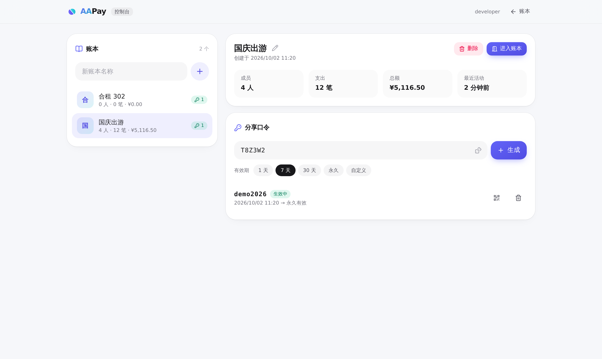

<p align="center">
  
</p>

<h1 align="center">AAPay</h1>

<p align="center">一起花钱，轻松算账 —— 多人记账、实时同步、一键结算</p>

<p align="center">
  
</p>
<p align="center">
  
  
</p>
<p align="center">
  
</p>

---

## 功能

- **口令加入**：协作者输入分享口令，或打开带口令的链接 / 扫二维码即可加入账本，无需注册
- **多日账本**：账目按天分组展示，每天带小计；支持「全部 / 今天 / 近 7 天 / 本月 / 自定义」范围与按成员筛选，附每日（或每月）支出柱状图，点击柱子可下钻到当天
- **结算**：综合全部支出与已记录的还款，计算每人净额并给出**最少转账方案**；点「已付」即记下一笔「谁向谁支付了多少」（可撤销），也可手动记录任意还款
- **记账**：金额、用途（常用用途一键填入）、日期、付款人、分摊成员；自动记住上次的付款人与分摊成员；支出可编辑、删除
- **金额精确**：全程以「分」为整数存储，均摊的零头按成员加入顺序分配，合计永远等于总额
- **实时同步**：基于 WebSocket，其他人的操作即时出现并弹出通知；断线自动重连并补齐数据
- **管理控制台**：创建 / 重命名 / 删除账本，生成带有效期的口令（1 天、7 天、30 天、永久或自定义时间段），二维码邀请，撤销口令后用它登录的成员立即失效，管理员可直接进入任意账本
- **共享模式**：单一公共账本，打开即用（适合固定室友）
- **体验**：移动端优先，底部抽屉式表单，自动跟随系统深色模式，可添加到主屏幕

## 架构

一套业务代码，两种运行方式：

```
                  ┌──────────── React 19 SPA（Vite · Tailwind CSS 4 · motion）────────────┐
                  │                hono/client 端到端类型 · WebSocket 实时同步               │
                  └──────────────────────────────────┬──────────────────────────────────┘
                                                     │ /api/*
                         ┌───────────────────────────┴────────────────────────────┐
                         │      Hono API（src/server/app.ts，平台无关）              │
                         │  会话 Cookie · 管理员认证 · zod 校验 · 业务服务（同步 SQL）  │
                         └─────────────┬────────────────────────────┬─────────────┘
                     Cloudflare Workers │                            │ Docker / Node
          ┌─────────────────────────────┴───────┐      ┌─────────────┴───────────────────────┐
          │ RegistryRoom（Durable Object）        │      │ data/registry.db（node:sqlite）      │
          │   账本列表 · 口令 · 会话               │      │ data/ledgers/<id>.db 每账本一个库     │
          │ LedgerRoom × N（每个账本一个 DO）      │      │ ws 实时推送 · 内置限流                │
          │   内置 SQLite · WebSocket Hibernation │      │ 单文件打包，运行时无 node_modules      │
          │ Workers Static Assets · Rate Limiting │      │                                      │
          └─────────────────────────────────────┘      └──────────────────────────────────────┘
```

- **每个账本一个独立数据库**：Cloudflare 上是一个 Durable Object（数据与实时连接在同一个对象里，强一致），Docker 中是一个 SQLite 文件
- **版本号驱动的同步**：每次变更递增版本号并广播事件，客户端发现缺口时自动重新拉取快照
- **会话**：口令换取随机会话令牌（HttpOnly Cookie），服务端只存其 SHA-256；撤销口令或删除账本会通过外键级联让会话立即失效

## 快速开始（本地开发）

需要 Node.js ≥ 22.13。

```bash
npm install
cp .dev.vars.example .dev.vars   # 本地放行管理员（ADMIN_AUTH=none）
npm run dev                      # Vite + Cloudflare 插件，在本地 workerd 中运行 Worker 与 Durable Objects
node scripts/seed.mjs            # 可选：生成演示账本（口令 demo2026）
```

打开 <http://localhost:5173>，管理控制台在 `/admin`。

也可以用 Node 运行时开发：`npm run dev:node`（Node 服务监听 8787，Vite 代理 `/api`）。

## 部署到 Cloudflare

1. 修改 `wrangler.jsonc` 中的 `routes`（自定义域名）与 `vars`
2. 在 Cloudflare Zero Trust → Access 新建 **Self-hosted** 应用：
   - 目标填 `你的域名/admin` 与 `你的域名/api/admin` 两条
   - 策略：Allow，Include → Emails → 你的邮箱
   - 把应用的 **Application Audience (AUD) Tag** 填入 `ACCESS_AUD`，团队域名（`xxx.cloudflareaccess.com`）填入 `ACCESS_TEAM_DOMAIN`
3. 部署：

   ```bash
   npx wrangler login
   npm run deploy
   ```

Durable Objects 与限流绑定由 `wrangler.jsonc` 自动创建，无需手动建数据库。Worker 会独立校验 Access 签发的 JWT（签名、issuer、audience，可选 `ADMIN_EMAILS` 白名单），即使绕过 Access 直连 Worker 也无法访问管理接口。

## 部署到 Docker

```bash
cp .env.example .env    # 按需修改，至少设置管理员认证方式
docker compose up -d --build
```

服务监听 `8787`，数据保存在 `./data`（`registry.db` + `ledgers/*.db`）。镜像基于 `node:24-alpine`，使用 Node 内置的 `node:sqlite`，不含任何原生依赖。

不想用 Docker 也可以直接运行：

```bash
npm run build:node && npm start   # 读取 .env
```

## 配置

Cloudflare（`wrangler.jsonc` 的 `vars` / `wrangler secret put`）与 Docker（`.env`）使用同一套变量：

| 变量 | 说明 | 默认 |
| --- | --- | --- |
| `MODE` | `isolated`：多账本 + 口令加入；`shared`：单一公共账本，无需口令，关闭管理后台 | `isolated` |
| `ADMIN_AUTH` | 管理员认证：`access` / `password` / `proxy` / `none` / `disabled` | `disabled` |
| `ACCESS_TEAM_DOMAIN` | `access` 模式：Access 团队域名，如 `myteam.cloudflareaccess.com` | — |
| `ACCESS_AUD` | `access` 模式：Access 应用的 AUD Tag | — |
| `ADMIN_PASSWORD` | `password` 模式：管理员密码（≥ 8 位；Cloudflare 上请用 secret） | — |
| `ADMIN_EMAIL_HEADER` | `proxy` 模式：上游代理传入身份的请求头 | `X-Forwarded-Email` |
| `ADMIN_EMAILS` | 可选，管理员邮箱白名单（逗号分隔，`access` / `proxy` 模式生效） | — |
| `PORT` / `DATA_DIR` | 仅 Node / Docker：端口与数据目录 | `8787` / `./data` |

管理员认证方式：

- **access**（推荐）：Cloudflare Workers 或 Docker + Cloudflare Tunnel，由 Access 负责登录
- **password**：内置密码登录，适合自托管且没有 SSO 的场景（带防爆破限流）
- **proxy**：沿用 oauth2-proxy / Authelia / Traefik ForwardAuth 等上游认证，信任其传入的身份头（确保应用不直接暴露）
- **none**：不校验，仅限本地开发

## 项目结构

```
src/
├── shared/             前后端共用：类型、zod 校验、金额工具、结算算法、事件 reducer
├── server/
│   ├── app.ts          Hono API（平台无关）
│   ├── config.ts       环境变量解析
│   ├── auth/           管理员认证（Access JWT / 密码 / 代理头）与 Cookie
│   ├── core/           RegistryService、LedgerService、SQL 抽象、RPC 信封
│   ├── cloudflare/     Worker 入口与 Durable Objects
│   └── node/           Node 入口、node:sqlite 驱动、WebSocket 房间
└── web/                React 前端（features/ledger、features/admin、features/join）
tests/                  vitest：金额、结算、账本服务、完整 API 流程
```

## API

| 方法 | 路径 | 说明 |
| --- | --- | --- |
| `GET` | `/api/config` | 运行模式与认证方式 |
| `GET` | `/api/session` | 当前会话（未加入时为 `null`） |
| `POST` | `/api/join` | 用口令加入账本 |
| `POST` | `/api/logout` | 退出账本 |
| `GET` | `/api/ledger` | 账本快照 |
| `GET` | `/api/ledger/live` | WebSocket 实时事件 |
| `POST` `PATCH` `DELETE` | `/api/ledger/members[/:id]` | 成员 |
| `POST` `PATCH` `DELETE` | `/api/ledger/expenses[/:id]` | 支出 |
| `POST` `DELETE` | `/api/ledger/settlements[/:id]` | 还款记录 |
| `GET` `POST` `PATCH` `DELETE` | `/api/admin/ledgers[/:id]` | 账本管理（含统计） |
| `GET` `POST` | `/api/admin/ledgers/:id/passphrases` | 分享口令 |
| `DELETE` | `/api/admin/passphrases/:id` | 撤销口令 |
| `POST` | `/api/admin/ledgers/:id/enter` | 管理员进入账本 |
| `GET` | `/api/admin/live` | 控制台 WebSocket |

## 开发命令

```bash
npm run typecheck   # TypeScript（web / worker / node 三个工程）
npm test            # vitest
npm run build       # Cloudflare 构建
npm run build:node  # Node / Docker 构建
```

> v2 为完全重写，数据结构与 v1 不兼容。

## 许可证

MIT
